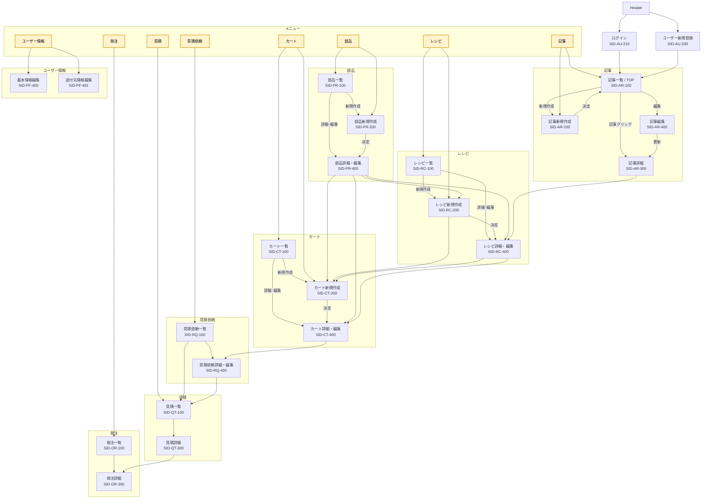

# 画面 ID 命名規約 (Screen ID Convention)

本システムの画面 ID は **`SID-<機能コード2桁>-<枝番3桁>`** の 3 ブロック固定形式とする。

| セグメント     | 桁数 | 例             | 意味                            |
| --------- | -- | ------------- | ----------------------------- |
| 固定プレフィックス | 3  | `SID`         | Screen ID を示す固定文字列            |
| **機能コード** | 2  | `PR`, `RC`, … | 機能領域を表す 2 文字アルファベット           |
| **枝番**    | 3  | `1 0 0`       | 1桁目＝画面種別 / 2桁目＝ロール種別 / 3桁目＝予備 |

---

## 機能コード表（2 桁）

| コード    | 機能               | 旧カテゴリ     |
| ------ | ---------------- | --------- |
| **PR** | 部品 (Parts)       | 部品系       |
| **RC** | レシピ (Recipe)     | レシピ系      |
| **CT** | カート (Cart)       | カート系      |
| **RQ** | 見積依頼 (ReQuest)   | 見積依頼系     |
| **QT** | 見積 (QuoTe)       | 見積系       |
| **OR** | 発注 (ORder)       | 発注系       |
| **AR** | 記事 (ARticle)     | 記事系       |
| **PF** | プロフィール (ProFile) | ユーザー情報系   |
| **AD** | 管理 (ADmin)       | 管理系       |
| **AU** | 認証 (AUth)        | ログイン / 登録 |

> 将来機能が追加された場合は、空いている 2 文字を割り当ててテーブルに追記すること。

---

## 枝番フォーマット

### 1 桁目: 画面種別

| 数字    | 種別 | 英語例   |
| ----- | -- | ----- |
| **1** | 一覧 | INDEX |
| **2** | 新規 | NEW   |
| **3** | 詳細 | SHOW  |
| **4** | 編集 | EDIT  |

### 2 桁目: ロール種別

| 数字    | ロール         | URL 例                  |
| ----- | ----------- | ---------------------- |
| **0** | 共通 / member | `/parts/...`           |
| **1** | vendor      | `/vendor/parts/...`    |
| **2** | admin       | `/admin/parts/...`     |
| **3** | affiliate   | `/affiliate/parts/...` |

> ロールごとにルーティングを分けない場合は **0** を使用。

### 3 桁目: 予備

* 000〜999 を自由に利用してバリエーションを増やせる。
* 同一画面で複数バリエーションが必要になった場合（例: 詳細画面が複数タイプ）、末尾を `1`,`2` … とインクリメントする。

---

## 命名例

| 画面                  | ID           | 分解例                                     |
| ------------------- | ------------ | --------------------------------------- |
| 部品一覧 (member 共通)    | `SID-PR-100` | PR = 部品, 1 = 一覧, 0 = member, 0 = 予備     |
| 部品新規作成 (vendor)     | `SID-PR-210` | PR = 部品, 2 = 新規, 1 = vendor, 0 = 予備     |
| 見積詳細 (member)       | `SID-QT-300` | QT = 見積, 3 = 詳細, 0 = member, 0 = 予備     |
| ユーザー基本情報編集 (member) | `SID-PF-400` | PF = プロフィール, 4 = 編集, 0 = member, 0 = 予備 |

---

この規約は **README.md** に組み込み、システム全体で一貫した画面 ID を運用すること。

# Member ロール 画面一覧 (SID 形式)

| 画面 ID | 画面名 |
|-------|--------|
| SID-AU-200 | ユーザー新規登録 |
| SID-AU-210 | ログイン |
| SID-PR-100 | 部品一覧 |
| SID-PR-200 | 部品新規作成 |
| SID-PR-400 | 部品詳細・編集 |
| SID-RC-100 | レシピ一覧 |
| SID-RC-200 | レシピ新規作成 | 
| SID-RC-400 | レシピ詳細・編集 | 
| SID-CT-100 | カート一覧 |
| SID-CT-200 | カート新規作成 |
| SID-CT-400 | カート詳細・編集 |
| SID-RQ-100 | 見積依頼一覧 |
| SID-RQ-400 | 見積依頼詳細・編集 |
| SID-QT-100 | 見積一覧 |
| SID-QT-300 | 見積詳細 |
| SID-OR-100 | 発注一覧 |
| SID-OR-300 | 発注詳細 |
| SID-AR-100 | 記事一覧（TOP） |
| SID-AR-300 | 記事詳細 |
| SID-AR-200 | 記事新規作成 |
| SID-AR-400 | 記事編集 |
| SID-PF-400 | ユーザー基本情報編集 |
| SID-PF-401 | ユーザー送付先情報編集 |

---

## 画面遷移図 (Mermaid)

