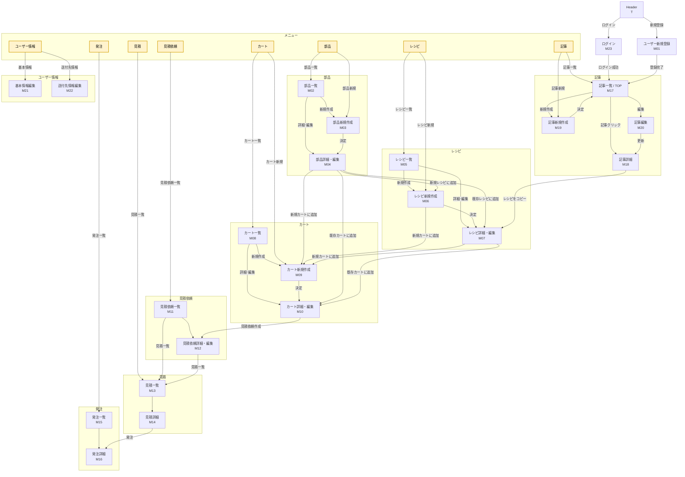

```mermaid
%% Member ロール画面遷移図（Mermaid v4: Menu クラスタ＋色付け）
flowchart TD
    %% ===== 共通ノード =====
    T[Header<br/>T]
    M01[ユーザー新規登録<br/>M01]
    M23[ログイン<br/>M23]

    %% ===== メニュークラスタ =====
    subgraph メニュー
        direction TB
        MENU_PARTS[部品]
        MENU_RECIPES[レシピ]
        MENU_CARTS[カート]
        MENU_REQUESTS[見積依頼]
        MENU_QUOTES[見積]
        MENU_ORDERS[発注]
        MENU_ARTICLES[記事]
        MENU_PROFILE[ユーザー情報]
    end

    %% assign style to menu nodes
    classDef menu fill:#FFF3CD,stroke:#D39E00,stroke-width:2px,color:#000;
    class MENU_PARTS,MENU_RECIPES,MENU_CARTS,MENU_REQUESTS,MENU_QUOTES,MENU_ORDERS,MENU_ARTICLES,MENU_PROFILE menu;

    %% ===== 部品クラスタ =====
    subgraph 部品
        direction TB
        M02[部品一覧<br/>M02]
        M03[部品新規作成<br/>M03]
        M04[部品詳細・編集<br/>M04]
        M02 -->|新規作成| M03
        M02 -->|詳細･編集| M04
        M03 -->|決定| M04
    end

    %% ===== レシピクラスタ =====
    subgraph レシピ
        direction TB
        M05[レシピ一覧<br/>M05]
        M06[レシピ新規作成<br/>M06]
        M07[レシピ詳細・編集<br/>M07]
        M05 -->|新規作成| M06
        M05 -->|詳細･編集| M07
        M06 -->|決定| M07
    end

    %% ===== カートクラスタ =====
    subgraph カート
        direction TB
        M08[カート一覧<br/>M08]
        M09[カート新規作成<br/>M09]
        M10[カート詳細・編集<br/>M10]
        M08 -->|新規作成| M09
        M08 -->|詳細･編集| M10
        M09 -->|決定| M10
    end

    %% ===== 見積依頼クラスタ =====
    subgraph 見積依頼
        direction TB
        M11[見積依頼一覧<br/>M11]
        M12[見積依頼詳細・編集<br/>M12]
        M11 --> M12
    end

    %% ===== 見積クラスタ =====
    subgraph 見積
        direction TB
        M13[見積一覧<br/>M13]
        M14[見積詳細<br/>M14]
        M13 --> M14
    end

    %% ===== 発注クラスタ =====
    subgraph 発注
        direction TB
        M15[発注一覧<br/>M15]
        M16[発注詳細<br/>M16]
        M15 --> M16
    end

    %% ===== 記事クラスタ =====
    subgraph 記事
        direction TB
        M17[記事一覧 / TOP<br/>M17]
        M18[記事詳細<br/>M18]
        M19[記事新規作成<br/>M19]
        M20[記事編集<br/>M20]
        M17 -->|記事クリック| M18
        M17 -->|新規作成| M19
        M17 -->|編集| M20
        M19 -->|決定| M17
        M20 -->|更新| M18
    end

    %% ===== ユーザー情報クラスタ =====
    subgraph ユーザー情報
        direction TB
        M21[基本情報編集<br/>M21]
        M22[送付先情報編集<br/>M22]
    end

    %% ===== メニュー → 機能 =====
    MENU_PARTS     -- 部品一覧 --> M02
    MENU_PARTS     -- 部品新規 --> M03
    MENU_RECIPES   -- レシピ一覧 --> M05
    MENU_RECIPES   -- レシピ新規 --> M06
    MENU_CARTS     -- カート一覧 --> M08
    MENU_CARTS     -- カート新規 --> M09
    MENU_REQUESTS  -- 見積依頼一覧 --> M11
    MENU_QUOTES    -- 見積一覧 --> M13
    MENU_ORDERS    -- 発注一覧 --> M15
    MENU_ARTICLES  -- 記事一覧 --> M17
    MENU_ARTICLES  -- 記事新規 --> M19
    MENU_PROFILE   -- 基本情報 --> M21
    MENU_PROFILE   -- 送付先情報 --> M22

    %% ===== ヘッダー・認証 =====
    T -- 新規登録 --> M01
    T -- ログイン --> M23
    M23 -- ログイン成功 --> M17
    M01 -- 登録完了 --> M17

    %% ===== クロス機能遷移 =====
    M04 -- 新規レシピに追加 --> M06
    M04 -- 既存レシピに追加 --> M07
    M04 -- 新規カートに追加 --> M09
    M04 -- 既存カートに追加 --> M10

    M06 -- 新規カートに追加 --> M09
    M07 -- 新規カートに追加 --> M09
    M07 -- 既存カートに追加 --> M10

    M18 -- レシピをコピー --> M07
    M10 -- 見積依頼作成 --> M12
    M11 -- 見積一覧 --> M13
    M12 -- 見積一覧 --> M13
    M14 -- 発注 --> M16
```
